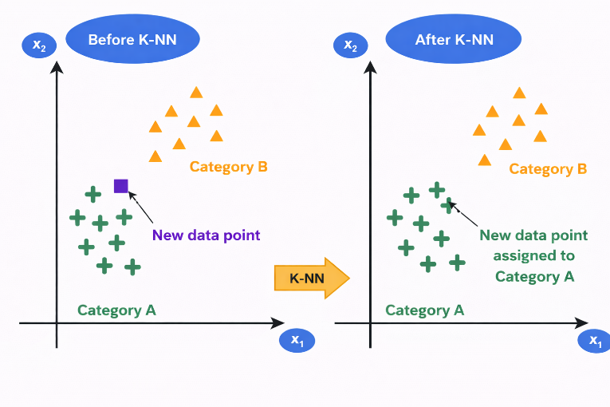

### 1. Overview

The k-Nearest Neighbours (KNN) algorithm is a supervised machine learning algorithm that is commonly used for both classification and regression tasks. It is considered a non-parametric method because it does not assume any predefined distribution for the data. Instead of learning a mathematical model during training, KNN makes predictions by comparing new data points with the existing training samples based on their similarity. This similarity is typically measured using distance metrics such as Euclidean distance, which determine how close one data point is to another in the feature space.

The concept of nearest neighbour classification was originally introduced by Fix and Hodges and later extended by Cover and Hart. In this method, when a new test sample is given, the algorithm identifies the k nearest training samples in the dataset and assigns a class label based on majority voting among those neighbours. The value of k represents the number of neighbouring data points considered during classification and plays an important role in determining the accuracy of the model.

Unlike many other machine learning algorithms, KNN does not involve an explicit training phase. Instead, it simply stores the entire training dataset and performs calculations only when a prediction is required. For this reason, it is often referred to as a lazy learning or instance-based learning algorithm. Since KNN relies on distance calculations, feature scaling is important to ensure that all features contribute equally to the distance measurement. Without proper scaling, features with larger numerical ranges may dominate the calculation and affect the performance of the algorithm.

### 2. Working of KNN

The working of the KNN algorithm involves identifying the nearest neighbours of a given data point and determining its class based on those neighbours. The basic steps followed by the algorithm are:

1. Choose the number of neighbours k.
2. Calculate the distance between the new data point and all points in the training dataset.
3. Sort the distances and identify the k nearest neighbours.
4. Count the class labels of these neighbours.
5. Assign the class that appears most frequently among them to the new data point.

Thus, the classification of a new data sample is determined by the majority class among its nearest neighbours.

### 3. Determining the Value of k

The parameter k represents the number of nearest neighbors considered for classification. Choosing an appropriate value of k is important for the performance of the algorithm. If k is too small, the model becomes sensitive to noise and may lead to overfitting. If k is too large, the model may include many distant points, which can reduce accuracy. In practice, the value of k is selected by testing different values and choosing the one that provides the best classification performance for the dataset.

### 4. Distance Metrics in KNN

#### 4.1 Euclidean Distance (L2 norm)

Euclidean distance (L2 norm) is the most commonly used distance metric in KNN, where the distance between two data points is computed as the straight-line distance in feature space. It is given by:

<math display="block" xmlns="http://www.w3.org/1998/Math/MathML">
  <mrow>
    <mi>d</mi>
    <mo>=</mo>
    <msqrt>
      <munderover>
        <mo>&#8721;</mo>
        <mrow><mi>i</mi><mo>=</mo><mn>1</mn></mrow>
        <mi>n</mi>
      </munderover>
      <msup>
        <mrow>
          <mo>(</mo>
          <msub><mi>x</mi><mi>i</mi></msub>
          <mo>-</mo>
          <msub><mi>y</mi><mi>i</mi></msub>
          <mo>)</mo>
        </mrow>
        <mn>2</mn>
      </msup>
    </msqrt>
  </mrow>
</math>

where xi and yi represent the values of the ith feature of data points X and Y, and n is the total number of features. In a two-dimensional space, this simplifies to:

<math display="block" xmlns="http://www.w3.org/1998/Math/MathML">
  <mrow>
    <mi>d</mi>
    <mo>=</mo>
    <msqrt>
      <msup>
        <mrow>
          <mo>(</mo><msub><mi>x</mi><mn>1</mn></msub><mo>-</mo><msub><mi>y</mi><mn>1</mn></msub><mo>)</mo>
        </mrow>
        <mn>2</mn>
      </msup>
      <mo>+</mo>
      <msup>
        <mrow>
          <mo>(</mo><msub><mi>x</mi><mn>2</mn></msub><mo>-</mo><msub><mi>y</mi><mn>2</mn></msub><mo>)</mo>
        </mrow>
        <mn>2</mn>
      </msup>
    </msqrt>
  </mrow>
</math>

This metric is intuitive and works well when features are continuous and on similar scales, as it captures the true geometric distance between points, making it effective for identifying the nearest neighbors in KNN classification.

Where:

- xi: value of the ith feature of data point X
- yi: value of the ith feature of data point Y
- n: total number of features (dimensions)
- For 2D: same reduced expression shown above

#### 4.2 Manhattan Distance (L1 norm)

Manhattan distance (L1 norm) is another widely used distance metric in KNN, where the distance between two data points is calculated as the sum of the absolute differences of their corresponding feature values. It is defined as:

<math display="block" xmlns="http://www.w3.org/1998/Math/MathML">
  <mrow>
    <mi>d</mi>
    <mo>=</mo>
    <munderover>
      <mo>&#8721;</mo>
      <mrow><mi>i</mi><mo>=</mo><mn>1</mn></mrow>
      <mi>n</mi>
    </munderover>
    <mo stretchy="false">|</mo><msub><mi>x</mi><mi>i</mi></msub><mo>-</mo><msub><mi>y</mi><mi>i</mi></msub><mo stretchy="false">|</mo>
  </mrow>
</math>

where xi and yi denote the values of the ith feature of data points X and Y, and n represents the total number of features. In a two-dimensional space, this simplifies to:

<math display="block" xmlns="http://www.w3.org/1998/Math/MathML">
  <mrow>
    <mi>d</mi>
    <mo>=</mo>
    <mo stretchy="false">|</mo><msub><mi>x</mi><mn>1</mn></msub><mo>-</mo><msub><mi>y</mi><mn>1</mn></msub><mo stretchy="false">|</mo>
    <mo>+</mo>
    <mo stretchy="false">|</mo><msub><mi>x</mi><mn>2</mn></msub><mo>-</mo><msub><mi>y</mi><mn>2</mn></msub><mo stretchy="false">|</mo>
  </mrow>
</math>

Unlike Euclidean distance, Manhattan distance measures movement along the axes, similar to navigating a grid, making it more robust to outliers and suitable for high-dimensional data or scenarios where feature differences are more meaningful than direct geometric distance.

Where:

- xi: value of the ith feature of data point X
- yi: value of the ith feature of data point Y
- n: total number of features
- For 2D: same reduced expression shown above

### 5. Non-Parametric Nature of KNN

The k-Nearest Neighbours algorithm is called a non-parametric model because it does not assume any specific mathematical distribution for the data. Instead of estimating parameters of a predefined equation, the algorithm stores the training samples and performs predictions by comparing new data points with the stored examples. Because no explicit model is learned during training, KNN is also considered an instance-based learning method where predictions are made directly using the training instances.

### 6. Hyperparameter Selection (Choosing the Value of k)

The value of k is a hyperparameter that determines how many neighbours participate in the classification decision. Choosing an appropriate value of k is important for achieving good performance.

- Small values of k such as k = 1 may make the model sensitive to noise and lead to overfitting.
- Large values of k may smooth the decision boundary too much and lead to underfitting.

Therefore, selecting a suitable value of k is necessary to balance bias and variance in the model. Typically, cross-validation techniques are used to determine the optimal value of k.

Figure 1: Illustration of K-Nearest Neighbors (K-NN) classification showing reassignment of a new data point based on nearest neighbors

The figure illustrates how the K-Nearest Neighbors (K-NN) algorithm classifies a new data point based on the majority class of its nearest neighbors. In the left panel (Before K-NN), two clusters are shown: Category A (green "+" points) and Category B (orange triangles). A new data point (shown in a different color and shape) lies between the two categories, and its class is initially unknown. In the right panel (After K-NN), the algorithm evaluates the nearest neighbors of the new data point. Since most of its closest points belong to Category A, the new data point is assigned to Category A. This is reflected by changing its color and shape to match Category A. This demonstrates how the KNN algorithm uses proximity and majority voting to classify new data samples.

### 7. Algorithm

Step 1: Store all training data  
Step 2: Choose the value of K  
Step 3: When a new data point arrives for classification:  
Step 4: Calculate distance from new point to all training points  
Step 5: Sort all training points by distance in ascending order  
Step 6: Select the K nearest neighbours  
Step 7: For Classification, use majority voting by counting how many of the K neighbours belong to each class

Step 8: For Regression, take the average of target values of K neighbours and compute prediction as:

<math display="block" xmlns="http://www.w3.org/1998/Math/MathML">
  <mrow>
    <mtext>Prediction</mtext>
    <mo>=</mo>
    <mfrac>
      <mrow>
        <msub><mtext>value</mtext><mn>1</mn></msub>
        <mo>+</mo>
        <msub><mtext>value</mtext><mn>2</mn></msub>
        <mo>+</mo>
        <mo>&#8230;</mo>
        <mo>+</mo>
        <msub><mtext>value</mtext><mi>k</mi></msub>
      </mrow>
      <mi>K</mi>
    </mfrac>
  </mrow>
</math>

### 8. Practical Considerations in K-Nearest Neighbors (KNN)

#### 8.1 Handling Ties

When K neighbours have equal votes:

- Reduce K by 1 and re-vote
- Or choose the class of the nearest neighbour among tied classes
- Or randomly select among tied classes

#### 8.2 Feature Scaling (Critical for KNN)

Why needed: KNN uses distance, so features with larger ranges dominate. Before applying KNN:

- Apply Min-Max Scaling:

<math display="block" xmlns="http://www.w3.org/1998/Math/MathML">
  <mrow>
    <msup><mi>x</mi><mo>&#8242;</mo></msup>
    <mo>=</mo>
    <mfrac>
      <mrow><mi>x</mi><mo>-</mo><msub><mi>x</mi><mtext>min</mtext></msub></mrow>
      <mrow><msub><mi>x</mi><mtext>max</mtext></msub><mo>-</mo><msub><mi>x</mi><mtext>min</mtext></msub></mrow>
    </mfrac>
  </mrow>
</math>

- Or Z-Score Normalization:

<math display="block" xmlns="http://www.w3.org/1998/Math/MathML">
  <mrow>
    <mi>z</mi>
    <mo>=</mo>
    <mfrac>
      <mrow><mi>x</mi><mo>-</mo><mi>&#956;</mi></mrow>
      <mi>&#963;</mi>
    </mfrac>
  </mrow>
</math>

#### 8.3 Choosing Optimal K: Cross-Validation Method

1. Split data into training and validation sets.
2. For K = 1, 3, 5, 7, ... try multiple values.
3. Train KNN with that K.
4. Measure accuracy on validation set.
5. Select K with highest validation accuracy.

### 9. Merits and Demerits of k-Nearest Neighbours (KNN)

| Merits of KNN | Demerits of KNN |
|---|---|
| Simple and easy to understand | High computational cost during prediction |
| Does not require an explicit training phase | Requires large memory to store training data |
| Makes no assumption about data distribution | Highly sensitive to feature scaling |
| Works well for small and well-separated datasets | Performance degrades in high-dimensional data |
| Can be used for both classification and regression | Sensitive to noise and outliers |

### 10. Applications

The K-Nearest Neighbours (KNN) algorithm is widely used in many real-world applications because of its simplicity and effectiveness in classification and prediction tasks. Some common applications include:

- Image Recognition: KNN is used in image classification systems where images are categorized based on similarities with labelled images in the dataset.
- Recommendation Systems: It helps recommend products, movies, or music by finding users with similar preferences.
- Medical Diagnosis: KNN can assist in disease prediction by comparing a patient's data with similar cases in medical datasets.
- Pattern Recognition: It is used to recognize patterns in data such as handwriting recognition or speech recognition.
- Credit Scoring and Fraud Detection: Financial institutions use KNN to classify transactions and detect unusual or fraudulent activities.

These applications demonstrate how KNN can effectively classify data based on similarity and proximity in different domains.
