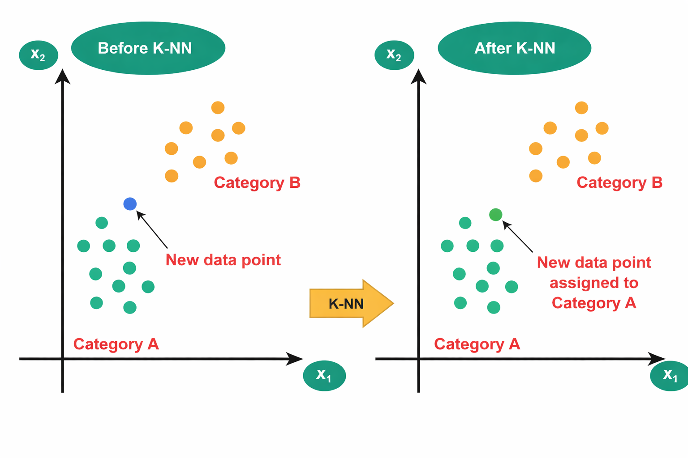

The k-Nearest Neighbours (KNN) algorithm is a supervised machine learning algorithm used for classification and regression. It is a non-parametric method, as it does not assume any prior distribution of the data. In KNN, classification is performed based on the similarity between data samples, which is commonly measured using distance metrics such as Euclidean distance.

#### 1. Algorithm Overview

The nearest neighbour classification concept was introduced by Fix and Hodges and later extended by Cover and Hart. In this method, a test sample is assigned a class label by identifying the k nearest training samples in the feature space and applying majority voting. The value of k represents the number of nearest neighbours considered for classification.

#### 2. Lazy Learning

KNN does not involve an explicit training phase. Instead, it stores the entire training dataset and performs computation during the testing phase. Hence, it is referred to as a **lazy learning** or **instance-based learning** algorithm. The choice of k significantly affects classifier performance. Smaller values of k may result in overfitting, while larger values of k may lead to underfitting.

#### 3. Feature Scaling

Since KNN is based on distance calculations, feature scaling is important to ensure that all features contribute equally. Without proper scaling, features with larger numerical ranges may dominate the distance computation.

#### 4. Merits of k-Nearest Neighbours (KNN)

- Simple and easy to understand
- Does not require an explicit training phase
- Makes no assumption about data distribution
- Works well for small and well-separated datasets
- Can be used for both classification and regression

#### 5. Demerits of k-Nearest Neighbours (KNN)

- High computational cost during prediction
- Requires large memory to store training data
- Highly sensitive to feature scaling
- Performance degrades in high-dimensional data
- Sensitive to noise and outliers

The figure below illustrates how K-NN assigns a class to a new data point by considering the majority class among its nearest neighbours.

#### 6. Algorithm

- **Step 1:** Store all training data
- **Step 2:** Choose the value of K
- **Step 3:** When a new data point arrives for classification:
- **Step 4:** Calculate distance from new point to all training points
- **Step 5:** Sort all training points by distance in ascending order
- **Step 6:** Select the K nearest neighbors
- **Step 7:** For **Classification**, use majority voting by counting how many of the K neighbors belong to each class
- **Step 8:** For **Regression**, take the average of target values of K neighbors and compute Prediction as `(value₁ + value₂ + ... + valueₖ) / K`

**Handling Ties:**
When K neighbors have equal votes:
- Reduce K by 1 and re-vote
- **OR** choose the class of the nearest neighbor among tied classes
- **OR** randomly select among tied classes

**Feature Scaling (Critical for KNN):**
*Why needed:* KNN uses distance, so features with larger ranges dominate.
Before applying KNN:
- Apply **Min-Max Scaling**: `x' = (x - min) / (max - min)`
- **OR** **Z-Score Normalization**: `x' = (x - mean) / std`

**Choosing Optimal K:**
*Cross-Validation Method:*
1. Split data into training and validation sets
2. For K = 1, 3, 5, 7, ... (try multiple values):
    - Train KNN with that K
    - Measure accuracy on validation set
3. Select K with highest validation accuracy

